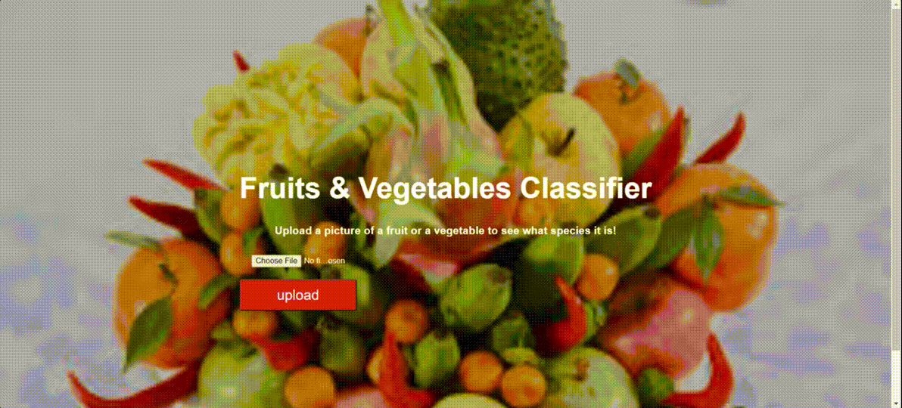

# What-is-this-Fruit
## Dataset:
It is available on Kaggle https://www.kaggle.com/moltean/fruits or  https://github.com/Horea94/Fruit-Images-Dataset

## Video Walkthrough
Here's a walkthrough of implemented features:

## Note:
The pretrained weight EfficientNet_B0.pth is limited by my computer. Thus, you can train model on your local one to gain the best trained weight ＼(￣▽￣)／.
